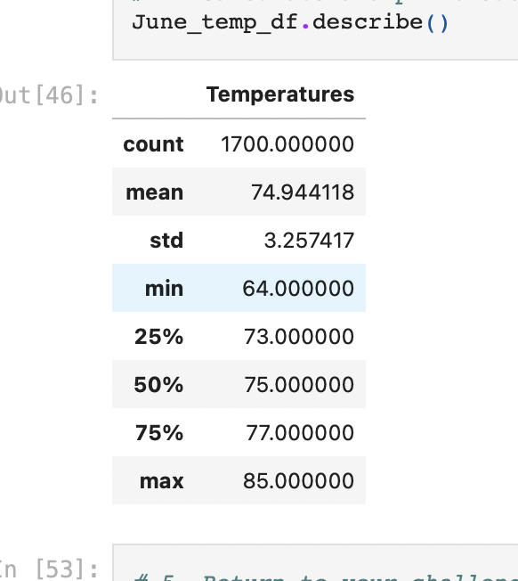
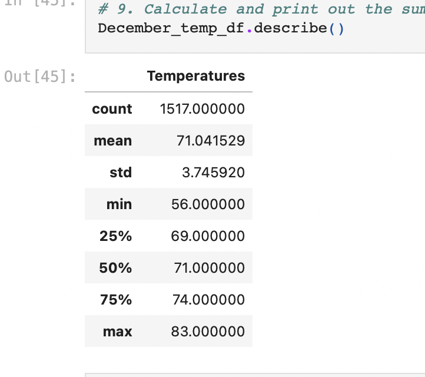

# Surfs_up 

## Purpose  

The purpose of the analysis was to determine the temperature data for the month of June and December in Oahu.  
 
##        
 
As expected there was  difference between the mean temperature for the months of June and December in Oahu, by a few degrees.  

  

## Summary 
The mean statistic for June temperature in Oahu is 74.94, while the mean temperature for Oahu in December is 71.04. As you can see that is a three degree difference. Although for minimum temperature there is a 10 degree difference. That suggests that there are days when the temperature can drop very low. At 25%, 50% and 75% both June and December temperatures have a difference of 2-3 degrees, with the temperature higher in June months. The standard deviation for June is 3.25 and December it's 3.74. One other query you could use to gather more data is look at the amount of icecream sold at other shops. Another is the amount of money spent on other desserts in general. 
